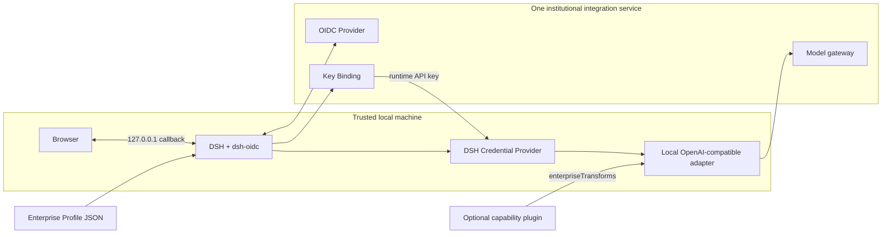

# dsh-oidc

> npm package: `@eduwork/dsh-oidc@0.1.0`. The previous unscoped package and scoped alpha remain available during migration. See [migration and data compatibility](docs/EDUWORK-MIGRATION.en.md).

[简体中文](README.md) | **English**

Standards-based enterprise identity and model integration for [DeepSeek Harness](https://github.com/deepseek-ai/deepseek-harness).

`dsh-oidc` composes four concerns behind one reviewed, declarative Enterprise Profile:

1. OpenID Connect Authorization Code flow with PKCE for a public client;
2. a fixed enterprise **Key Binding** protocol that exchanges the authenticated OIDC access token for a revocable model runtime credential;
3. an audited local OpenAI-compatible DSH Provider adapter; and
4. bounded product branding plus a shared account and enterprise-model settings UI.

The plugin is Web-first and has no Wails dependency. A desktop product can select the native account backend without changing the profile, Provider routes, UI contract, or Key Binding semantics.

> **Current release: 0.1.0.** The source targets DSH `0.1.2-rc.1` exactly (commit `a66e4702…`) and locks and checks the complete DSH peer closure. The package has a stable version number, while the Enterprise Profile remains `v1alpha1`; real OIDC/Key Binding integration and host credential-isolation review are still required before production use.

Integrating your own organization? Read the **[server API specification](docs/server-integration-contract.en.md)** first, then follow the **[getting-started guide](docs/getting-started.en.md)**. The first defines, with requests, responses, fields, and errors, the OIDC + PKCE, Key Binding, and model-gateway capabilities one institutional service must jointly deliver; the second covers configuration, installation, acceptance, and troubleshooting.

## Why this boundary

An organization should be able to integrate DSH without forking DSH, shipping executable configuration, or binding its identity layer to one desktop shell. The organization supplies data and standards-compliant endpoints; the plugin owns the executable adapter and validates that data before use.



The Enterprise Profile is data only. It cannot name JavaScript modules, inject CSS, install tools or skills, or redefine Key Binding paths and wire fields.

## What is included

- fixed loopback callback `http://127.0.0.1:<DSH-port>/oauth/callback`;
- OIDC Discovery, PKCE S256, state, nonce, RS256 ID Token validation, UserInfo subject binding, refresh, and optional revocation;
- `userinfo.name` for display, falling back only to the required `userinfo.sub`;
- fixed `worker-user-center-v1` endpoints for bootstrap, provision, resolve, and renew;
- DSH Credential Provider storage for OIDC session material and the runtime API key;
- declarative provider/model catalog and bounded brand tokens;
- one capability-aware enterprise-service settings section shared by Web and native hosts through DSH's official `settings.section` extension point;
- a native backend adapter boundary for desktop products;
- a stable `enterpriseTransforms` service for capabilities such as a text-model image fallback without forking the Provider route.

Not included: an OIDC Provider, a Key Binding server, multi-user session storage, an organization directory, quota UI, a desktop shell, or remote executable plugins.

## Branding scope

`dsh-oidc` already includes bounded product branding. An Enterprise Profile may declare:

- `productName`, `organizationName`, and a one-to-four-character `mark`;
- an HTTPS or base64 PNG/WebP `logoURL`;
- a six-digit hexadecimal `primaryColor`;
- `loginTitle`, `loginDescription`, and an HTTPS `supportURL`.

These values affect the document title, sidebar brand, conversation hero mark, login/confirmation surfaces, and a bounded set of DSH theme tokens. They cannot inject arbitrary CSS, SVG, scripts, or components, and they do not replace a desktop shell, updater, quota UI, or institution-specific business pages. See the [Enterprise Profile specification](docs/enterprise-profile.en.md#branding) for limits and security rules.

## Requirements

- Node.js 22 or newer;
- the exact DeepSeek Harness `0.1.2-rc.1` peer set;
- an OIDC Public Client without a Client Secret that registers `http://127.0.0.1:3080/oauth/callback` exactly;
- Discovery metadata with PKCE S256, RS256 ID Tokens, and `userinfo_endpoint`;
- one institutional integration service implementing the complete [server contract](docs/server-integration-contract.en.md), including Key Binding and the model gateway;
- a DSH Credential Provider appropriate for the deployment.

The current Web backend is intentionally limited to a trusted, single-user DSH process bound to `127.0.0.1`. It is not a shared public-Web session solution. See [Security model](docs/security-model.en.md).

## Install

Install the reviewed, exact version from npm:

```bash
dsh plugin --profile web add @eduwork/dsh-oidc@0.1.0
```

For auditing, development, or testing unpublished changes, install from a local checkout instead:

```bash
git clone https://github.com/freedomkk-qfeng/dsh-oidc.git
cd dsh-oidc
npm ci
npm run check
dsh plugin --profile web add .
```

The local-path form links the checkout into the DSH `web` Profile, so keep the source directory in place. Team deployments should pin a reviewed, exact npm version and must not mix another DSH prerelease line into the same profile.

Advanced products may instead add it explicitly to their own DSH bundle patch:

```yaml
- insert:
    - id: enterprise-oidc
      name: '@eduwork/dsh-oidc'
      config:
        profilePathEnv: DSH_OIDC_ENTERPRISE_PROFILE
```

Set `DSH_OIDC_ENTERPRISE_PROFILE` to a trusted local JSON file. Start from [`examples/enterprise-profile.example.json`](examples/enterprise-profile.example.json) and validate it with [`schema/enterprise-profile.v1alpha1.schema.json`](schema/enterprise-profile.v1alpha1.schema.json).

Start DSH on the fixed IPv4 loopback host. The public OIDC client must register exactly:

```text
http://127.0.0.1:3080/oauth/callback
```

The callback host and path are not configurable. The port follows the actual DSH WebServer port; if the operator changes `3080`, the OIDC registration must use the same port.

## Configuration surfaces

| Plugin config | Purpose |
| --- | --- |
| `profile` | One inline Enterprise Profile object. |
| `profiles` | An array of inline Enterprise Profiles. Provider IDs must also be unique. |
| `profilePathEnv` | Name of an environment variable containing the trusted JSON profile path. |
| `backend` | `web` (default) or `native`. Native delegates account lifecycle to the host's `enterpriseAccounts` service. |
| `uiMode` | `standard` (shared model settings plus account/onboarding/branding), `models-only` (shared model settings only), or `external` (no plugin UI). |
| `web.returnPath` | Same-origin absolute path after callback; defaults to `/`. |
| `allowEmptyProfiles` | Allows the plugin service to start with no profile, mainly for composition tests. |

See [Enterprise Profile](docs/enterprise-profile.en.md) for every data field and trust rule.

## Protocol summary

OIDC remains standard OIDC. The plugin does not support custom “userinfo field mapping”: `name` is the standard display claim and `sub` is the guaranteed stable fallback. OIDC, Key Binding, and the model gateway form one required institutional server contract; they are not optional alternatives. See the [complete server integration contract](docs/server-integration-contract.en.md).

Given `keyBinding.baseURL = https://ai.example.edu/api/worker/v1`, the only valid operations are:

- `GET /bootstrap`
- `POST /runtime-credential/provision`
- `POST /runtime-credential/resolve`
- `POST /runtime-credential/renew`

The profile cannot change these paths or their fields. [`protocol/openapi.yaml`](protocol/openapi.yaml) is the machine-readable contract; [Key Binding protocol](docs/key-binding-protocol.en.md) defines normative behavior, authorization, idempotency, logging, and lifecycle semantics.

Provider ID determines the runtime route and, by default, derives the local credential reference (for example, `example-ai` becomes `EXAMPLE_AI_API_KEY`). Production and test deployments that reuse one Provider ID may explicitly isolate their local secret entries with `keyBinding.credentialRef`; this does not change the server API.

## Development

```bash
npm ci
npm run check
```

`npm run check` verifies the DSH rc.1 Host, Client, Provider, WebServer, credentials, and Typert contracts; rebuilds both plugin faces; runs unit/security-contract tests; validates examples and OpenAPI structure; scans publishable sources for common secrets, personal paths, non-example addresses, and ECNU service endpoints; and inspects the npm tarball.

The repository intentionally keeps Host code as native ESM under `src/host`; `scripts/build-host.mjs` copies it to `lib`. The DSH browser client is bundled as the loader-compatible `lib/client.js`.

## Documentation

- [Architecture and boundaries](docs/architecture.en.md)
- [Complete institutional server integration contract](docs/server-integration-contract.en.md)
- [Third-party getting-started guide](docs/getting-started.en.md)
- [Enterprise Profile specification](docs/enterprise-profile.en.md)
- [OIDC interoperability profile](docs/oidc-interoperability.en.md)
- [Key Binding protocol](docs/key-binding-protocol.en.md)
- [Security model and deployment requirements](docs/security-model.en.md)
- [DSH integration and extension seams](docs/dsh-integration.en.md)
- [ECNU reference composition](docs/ecnu-reference.en.md)
- [Compatibility and release policy](docs/compatibility.en.md)
- [Public release checklist](docs/release-checklist.en.md)
- [Contribution guide](CONTRIBUTING.en.md), [security policy](SECURITY.en.md), and [governance](GOVERNANCE.en.md)

## License and trademarks

Code and original documentation are licensed under MIT. Dependency notices are in [THIRD_PARTY_NOTICES.en.md](THIRD_PARTY_NOTICES.en.md).

DeepSeek Harness and DeepSeek are names of their respective owners. “华东师范大学”, “ECNU”, “ChatECNU”, and associated marks remain the property of their respective rights holders. The ECNU file in `examples/` is a placeholder reference configuration, contains no production endpoint or client identifier, and does not grant trademark rights.
