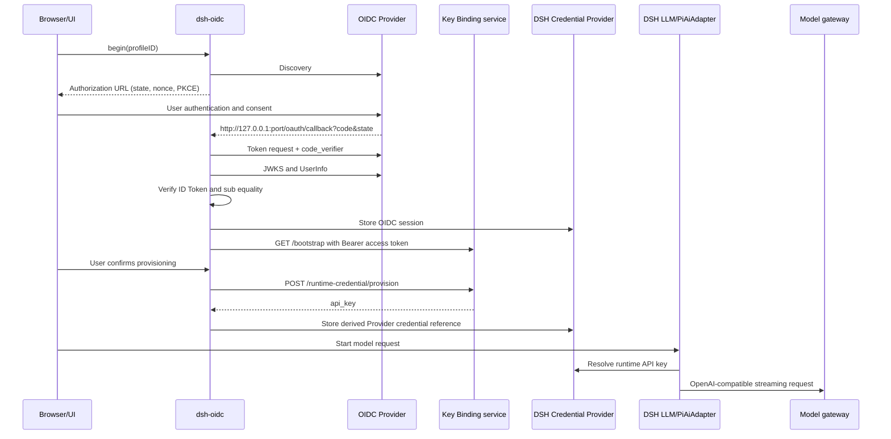

# Architecture and boundaries

[简体中文](architecture.md) | **English**

## Goals

`dsh-oidc` lets an organization integrate identity, entitlement, model credentials, Provider metadata, and bounded branding into an ordinary DSH host without forking DSH or requiring a desktop shell.

The design follows five rules:

1. **DSH owns the runtime.** The plugin uses official DSH services and `PiAiAdapter`; it does not implement a parallel conversation or model transport stack.
2. **Standards own identity.** Authentication uses OIDC Discovery, Authorization Code + PKCE, ID Tokens, UserInfo, refresh, and optional revocation.
3. **The institutional service is one complete delivery boundary.** One accountable owner must jointly deliver OIDC, fixed Key Binding, and the model gateway; a Profile declares only their public endpoints and facts.
4. **Configuration is data, not code.** A profile cannot select executable adapters, arbitrary endpoint paths, scripts, stylesheets, tools, or skills.
5. **Product-specific capabilities compose around the core.** The common enterprise-model settings surface belongs to `dsh-oidc`; desktop shells, quota views, model transforms, or institutional pages remain separate plugins/services.

## Runtime components

| Component | Responsibility | Trust level |
| --- | --- | --- |
| DSH Host | Lifecycle, Cordis services, LLM registry, WebServer, credentials, attachments | Trusted executable host |
| `dsh-oidc` Host face | Profile validation, OIDC client, Key Binding client, local Provider registration | Trusted local plugin |
| `dsh-oidc` Client face | Account/onboarding surfaces, shared enterprise-model settings, and bounded branding | Trusted local plugin |
| Enterprise Profile | Declarative integration facts | Trusted configuration, still validated fail-closed |
| Institutional enterprise-model integration service | Joint OIDC identity, Key Binding authorization/credential lifecycle, and OpenAI-compatible model gateway | Remote identity, authorization, and data-processing authority |
| Capability plugin | Optional request-bound transform such as image-to-text fallback | Separately trusted local plugin |

## Control flow



The OIDC Provider, Key Binding, and model gateway in the diagram are three interface groups in one [server API specification](server-integration-contract.en.md). They may route to different internal systems or origins, but an operator cannot choose only a subset. The Web callback always returns to local `127.0.0.1`, not a public institutional DSH address.

## Code layout

- `src/host/index.js`: DSH service entry and Typert remote methods.
- `src/host/oidc.js`: Web and native account backends.
- `src/host/profile.js`: validation, imports, public projection, Provider projection.
- `src/host/provider/`: local DSH/PiAi Provider adapter and transform seam.
- `src/client/`: DSH browser bundle, account surfaces, and remote descriptors.
- `schema/`: machine-readable Enterprise Profile contract.
- `protocol/openapi.yaml`: machine-readable Key Binding contract.
- `docs/`: normative prose, threat model, and integration guidance.

Host files remain readable native ESM and are copied to `lib/` during build. Client code is bundled into DSH's module-loader closure format. Published packages include built artifacts and the two machine-readable contracts.

## Identity boundary

OIDC is the only authentication and identity source in the Web backend, which starts only when the DSH WebServer listens exactly on `127.0.0.1`. The plugin binds three values:

- configured issuer;
- configured public client ID;
- authenticated `sub` shared by the ID Token and UserInfo response.

`userinfo.name` is display-only and falls back to `userinfo.sub`. Key Binding `bootstrap.subject`, if present, is informational and cannot overwrite identity. This prevents a private management API from silently becoming a second, incompatible identity protocol.

## Credential boundary

The Key Binding service returns the model API key exactly once per resolve/provision/renew response. `dsh-oidc` writes it under a deterministic DSH credential reference derived from Provider ID:

```text
example-ai -> EXAMPLE_AI_API_KEY
```

The Provider adapter resolves that reference at request time. It never reads an ambient pi-ai credential store and never places the key in the Enterprise Profile, UI payload, logs, or DSH transcript.

Credential storage security is delegated to the active DSH Credential Provider. That is an explicit host contract, not proof that every DSH deployment is multi-user safe.

## Provider ownership and extension

Each profile declares one Provider ID and one or more models. `dsh-oidc` owns those routes through DSH's official `PiAiAdapter` and `@earendil-works/pi-ai` OpenAI Completions implementation.

Optional feature plugins register a transform through the Cordis service `enterpriseTransforms`. A transform may:

- advertise an aggregate modality for a specific Provider/model;
- rewrite the provider-bound request;
- inspect the model's native modalities.

It must not mutate the durable transcript or register a competing adapter for the same route. Native multimodal routes can therefore bypass a text-only image-understanding fallback, while text-only routes can opt into it.

## Native desktop boundary

`backend: native` delegates identity lifecycle and optional mutable enterprise-provider management to a host service named `enterpriseAccounts`. This exists for desktop products that require operating-system browser launch, loopback coordination, OS credential vaults, or locally persisted provider choices.

Wails is not part of this repository or interface. A non-Wails desktop, mobile host, or another local shell can implement the same service. The same component registers one `settings.section` entry in both modes: Web presents trusted Enterprise Profiles read-only, while a native host may advertise add/switch/model-edit/restart capabilities. This official whole-page extension avoids depending on or patching the internals of DSH's Models page. `uiMode: models-only` lets a product reuse exactly that surface while retaining separate account, quota, update, or diagnostic surfaces; `external` disables all plugin UI.

## Deliberate exclusions

- arbitrary userinfo endpoint or claim-path mapping;
- arbitrary Key Binding paths/fields;
- remote modules, CSS, tools, or skills;
- model quota and institution directory schemas;
- server-side web sessions for a shared multi-user DSH host;
- dynamic Provider adapter selection.

These exclusions reduce protocol ambiguity and keep executable trust local and reviewable.
